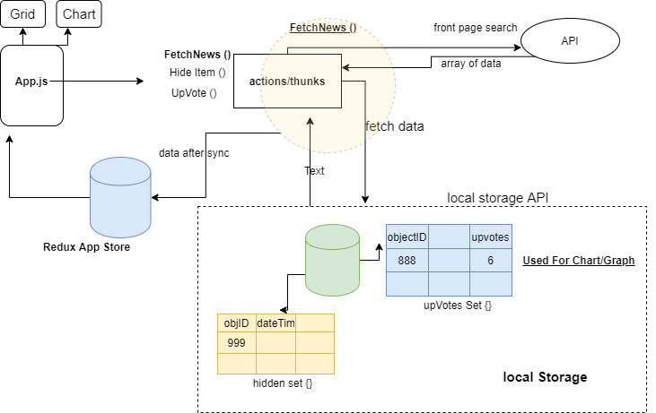

# [Hacker-news](https://news.ycombinator.com/) (front page) Clone using React /SSR

This project was bootstrapped with [Create React App](https://github.com/facebook/create-react-app).

### [See Demo](https://rk-hacker-news-clone.herokuapp.com/)

## Technology Stack

- Editor
  - VS Code
- Development
  - ReactJS
  - Redux
  - thunk
  - axios
  - react-icons
  - sass
  - lodash
  - momentJS
  - [react-charts](https://github.com/tannerlinsley/react-charts)
- Testing
  - Jest
  - Enzyme
- Deployment
  - Travis CI
  - Heroku

### Data: https://hn.algolia.com/api

### CI-CD Pipeline : [Travis CI](https://travis-ci.com/github/rohit-khanna)

## Application Flow

### Fetch News Flow

When `FetchNews()` API is invoked, the following steps are followed:

1.  fetch Data from External API
    - data is **normalized** before processing
2.  fetch local upvote data
3.  fetch locla hiddn items

The Data from all three steps is merged and then updated in store.

---

### Upvote Flow

When `upvote()` is invoked, the localServiceAPI is updated with new vote count and the associated `dispatch` updates the store. And hence Chart+Grid.

---

### hide item Flow

When `hideItem()` is invoked, the localServiceAPI is updated with new list of Hidden Items and the associated `dispatch` updates the store. And hence Chart+Grid.

## Approach

1. When a certain URL is requested, the requested is directed by `express server` to `Router` which selects the matching `Component` for that route.
2. The `serverRenderer` fetches the Data from external API as per the query params of the `URL`. This data is Stored in Server-Store ( _and also set as Initial State for Client-Redux Store_)
3. Componet is bound to this data via Redux-`connect` and this `server rendered component` is returned to Browser.
4. The App [`client`] looks to the redux store so see if a `sync` is required?
   - **Sync** : is the process in which the external data is filtered/ modified as per data stored in `Local Service`.
5. Once SYnc is done,new data is savd into `client redux store` and the same is used by Grid and Chart.
6. On `Prev` or `Next` click, API call is triggered from `Client` to refetch the desired result, than requesting `server rendered page` again from Express Server.
7. On `UpVote` and `Hide`, the Changes are saved with the help of `local Service API/ localstorage Service` and the same will be available during future `SYNC` process.
